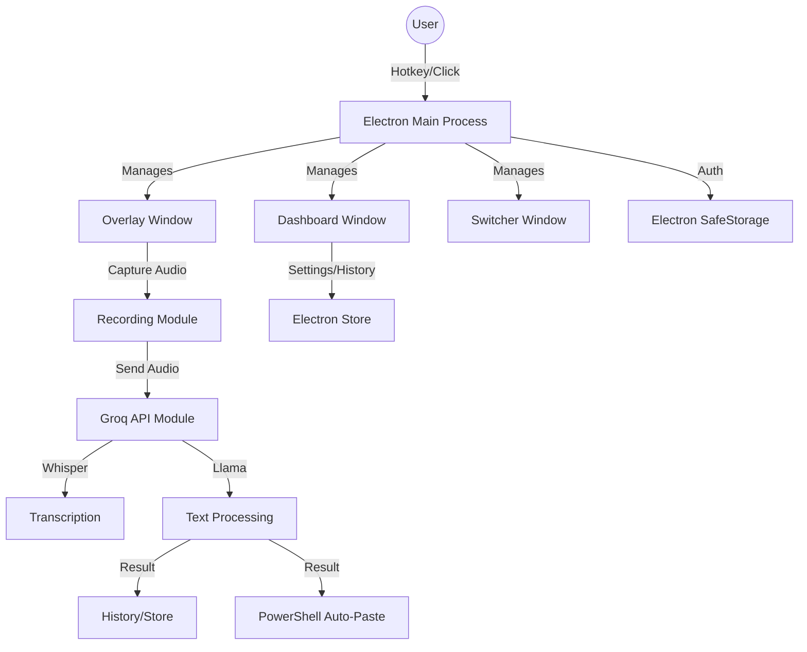

# Architecture

> Auto-generated by /map on 2026-01-19

## Overview

VoiceFlow is an Electron-based desktop application that provides a multi-platform dictation suite with AI integration. It uses the Groq API (Whisper and Llama models) for fast transcription and intelligent text processing.

## Components

### Main Process (`main.js`)
- **Purpose:** App entry point, window management, system tray, global hotkeys, IPC handlers, and auto-updater.
- **Location:** `desktop/main.js`
- **Dependencies:** `electron`, `electron-updater`, `electron-log`, `config/store.js`.

### Renderer Components (`renderer/`)
- **Dashboard (`dashboard.html`):** Main management UI for settings, history, and custom modes.
- **Overlay (`overlay.html`):** Translucent HUD for recording status and quick controls.
- **Switcher (`switcher.html`):** Quick mode selector triggered via Alt+M.
- **API Wrapper (`api.js`):** Encapsulates Groq API calls for Whisper and Llama.
- **Recording Logic (`recording.js`):** Handles audio stream capture and processing.

### Configuration Layer (`config/store.js`)
- **Purpose:** Persistent storage for user settings, history, custom modes, and dictionary entries.
- **Location:** `desktop/config/store.js`
- **Dependencies:** `electron-store`, `electron.safeStorage`.

## Data Flow

1. **Activation:** User triggers recording via global hotkey (default: `Ctrl+Shift+D`) or overlay button.
2. **Audio Capture:** `recording.js` captures audio from the selected input device.
3. **Transcription:** Audio data is sent to Groq Whisper API for conversion to text.
4. **Transform:** Transcribed text is processed by Groq Llama models according to the active transcription mode (e.g., "Standard", "E-Mail", "Jira").
5. **Output:** The final text is added to the history, copied to the clipboard, and optionally pasted into the previously active application using PowerShell `SendKeys`.

## Integration Points

| Service | Type | Purpose |
|---------|------|---------|
| Groq Cloud API | REST | AI Transcription (Whisper) and Chat Completion (Llama) |
| GitHub | VCS | Auto-updates and repository hosting |

## Technical Debt

- [ ] **Error Handling:** Some IPC handlers have broad try-catch blocks that could be more specific.
- [ ] **Cross-Platform:** Auto-paste currently relies on PowerShell, which limits this feature to Windows.
- [ ] **Testing:** `tests/` exists but coverage should be verified for core logic in `main.js`.
- [ ] **Modularity:** `dashboard.js` and `dashboard.html` are very large (40k+ characters / 24k+ characters) and could benefit from componentization.

## Conventions

**Naming:** camelCase for variables/functions, PascalCase for classes, UPPER_SNAKE_CASE for constants.
**Structure:** Traditional Electron structure with `main.js`, `preload.js`, and `renderer/`.
**Testing:** Vitest for unit testing.
