# VoiceFlow: Agent Task Distribution

## Overview

Phase 1 MVP is divided into **4 parallel workstreams**. Each agent works independently, with sync points at integration.

---

## Agent A: Core/Main Process

**Focus**: Electron main process, IPC, hotkeys, tray

### Files to Create

| File | Description |
|------|-------------|
| `desktop/main.js` | Main process, window management, IPC handlers |
| `desktop/preload.js` | Context bridge for secure renderer APIs |

### Tasks

- [ ] **A1**: Create main.js with BrowserWindow (hidden main, overlay)
- [ ] **A2**: Implement globalShortcut registration (`Ctrl+Shift+D`)
- [ ] **A3**: Create system tray with context menu (Settings, Quit)
- [ ] **A4**: Implement IPC handlers: `start-recording`, `stop-recording`, `get-result`
- [ ] **A5**: Implement clipboard operations: `copy-to-clipboard`, `simulate-paste`
- [ ] **A6**: Create preload.js with contextBridge exposing safe APIs

### Dependencies

- Receives: Events from Agent B (UI triggers)
- Provides: IPC bridge for Agent B, calls Agent C's API functions

### Acceptance Criteria

```
✓ Ctrl+Shift+D toggles overlay window visibility
✓ Tray icon visible with working context menu
✓ Recording state managed via IPC
✓ Text inserted via clipboard + Ctrl+V simulation
```

---

## Agent B: UI/Renderer

**Focus**: Recording overlay, settings panel, visual feedback

### Files to Create

| File | Description |
|------|-------------|
| `desktop/renderer/index.html` | Overlay window structure |
| `desktop/renderer/styles.css` | Dark theme, animations |
| `desktop/renderer/recording.js` | Audio capture with MediaRecorder |
| `desktop/renderer/settings.js` | Settings panel logic |

### Tasks

- [ ] **B1**: Create index.html with overlay structure (recording view, settings view)
- [ ] **B2**: Implement styles.css with design system (colors, typography, animations)
- [ ] **B3**: Create recording.js with MediaRecorder (WebM/Opus format)
- [ ] **B4**: Implement timer display and waveform visualization
- [ ] **B5**: Create settings.js with API key input form
- [ ] **B6**: Implement progress states: Recording → Transcribing → Cleaning → Done
- [ ] **B7**: Add toast notifications for errors and success

### Dependencies

- Uses: preload.js APIs from Agent A
- Integrates: API functions from Agent C (via IPC)

### Acceptance Criteria

```
✓ Recording overlay shows red indicator + timer
✓ Progress states transition smoothly
✓ Settings panel saves/loads API key
✓ Toast notifications appear for all states
✓ Dark theme matches design system
```

---

## Agent C: API Integration

**Focus**: Groq API wrappers, retry logic, error handling

### Files to Create

| File | Description |
|------|-------------|
| `desktop/renderer/api.js` | Groq Whisper + Llama API calls |
| `desktop/config/prompts.js` | LLM system prompts per mode |

### Tasks

- [ ] **C1**: Implement `transcribe(audioBlob, apiKey)` for Whisper API
- [ ] **C2**: Implement `cleanText(rawText, apiKey, mode)` for Llama API
- [ ] **C3**: Add retry logic with exponential backoff (3 attempts, 1s → 2s → 4s)
- [ ] **C4**: Implement error classification (network, auth, rate-limit, server)
- [ ] **C5**: Create prompts.js with Standard-Modus prompt
- [ ] **C6**: Add response validation and fallback (return raw text on LLM failure)

### Dependencies

- Standalone module, no dependencies on other agents
- Provides: API functions consumed by Agent B via IPC

### Acceptance Criteria

```
✓ Whisper transcription returns text for German audio
✓ Llama cleanup removes filler words, fixes corrections
✓ Retry works for transient 429/500 errors
✓ Graceful fallback to raw text on API failure
```

---

## Agent D: Config & Build

**Focus**: Secure storage, packaging, project setup

### Files to Create

| File | Description |
|------|-------------|
| `desktop/package.json` | Dependencies, scripts, metadata |
| `desktop/forge.config.js` | Electron Forge packaging config |
| `desktop/config/store.js` | Encrypted storage with safeStorage |
| `desktop/.gitignore` | Ignore node_modules, out/, .env |

### Tasks

- [ ] **D1**: Create package.json with all dependencies and scripts
- [ ] **D2**: Configure Electron Forge with Squirrel.Windows maker
- [ ] **D3**: Implement store.js with safeStorage encryption for API keys
- [ ] **D4**: Create .gitignore for Node.js/Electron project
- [ ] **D5**: Add npm scripts: `dev`, `build`, `make`, `test`
- [ ] **D6**: Create placeholder icons (tray, app icon)

### Dependencies

- Standalone, can start immediately
- Provides: Project foundation for all agents

### Acceptance Criteria

```
✓ npm install completes without errors
✓ npm run dev launches Electron app
✓ npm run make produces .exe installer
✓ API key persists encrypted after restart
```

---

## Sync Points

| Milestone | Agents | Deliverable |
|-----------|--------|-------------|
| **M1: Scaffold** | D | package.json, forge.config.js ready |
| **M2: Core Ready** | A, D | Main process runs, tray visible |
| **M3: UI Ready** | B | Overlay shows, recording works |
| **M4: API Ready** | C | Transcription + cleanup working |
| **M5: Integration** | All | Full pipeline: Record → API → Paste |
| **M6: Release** | All | Tested .exe installer on GitHub |

---

## Parallel Execution Order

```mermaid
gantt
    title Phase 1 MVP - Parallel Agent Work
    dateFormat HH:mm
    axisFormat %H:%M
    
    section Agent D (Config)
    D1-D4 Package Setup    :d1, 00:00, 30m
    D5-D6 Build Config     :d2, after d1, 30m
    
    section Agent A (Core)
    A1-A3 Main + Tray      :a1, 00:00, 60m
    A4-A6 IPC + Preload    :a2, after a1, 60m
    
    section Agent B (UI)
    B1-B3 HTML + CSS + Rec :b1, 00:30, 60m
    B4-B7 States + Toast   :b2, after b1, 60m
    
    section Agent C (API)
    C1-C4 API Wrappers     :c1, 00:00, 60m
    C5-C6 Prompts + Fallback :c2, after c1, 30m
    
    section Integration
    Integration Testing    :int, 02:30, 60m
```



---

## Quick Start for Agents

```bash
# All agents: Clone and navigate
cd c:\Users\maxos\voice-flow

# Agent D runs first (or parallel)
# Creates desktop/package.json, then:
cd desktop && npm install

# All agents work in desktop/ folder
# Run dev server to test:
npm run dev
```

---

## Communication Protocol

- **Blocking issues**: Comment in this file under agent section
- **Interface changes**: Update this file, notify other agents
- **Completion**: Mark tasks with [x], update sync point status
